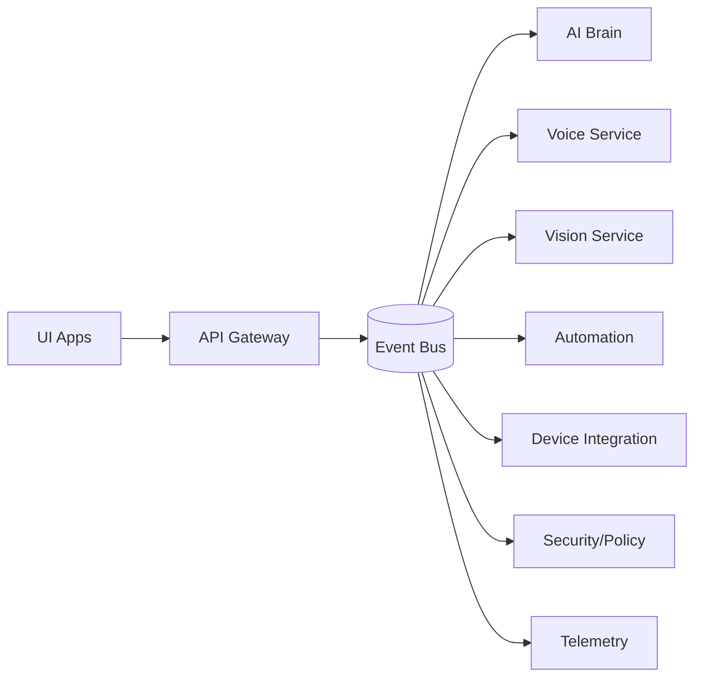
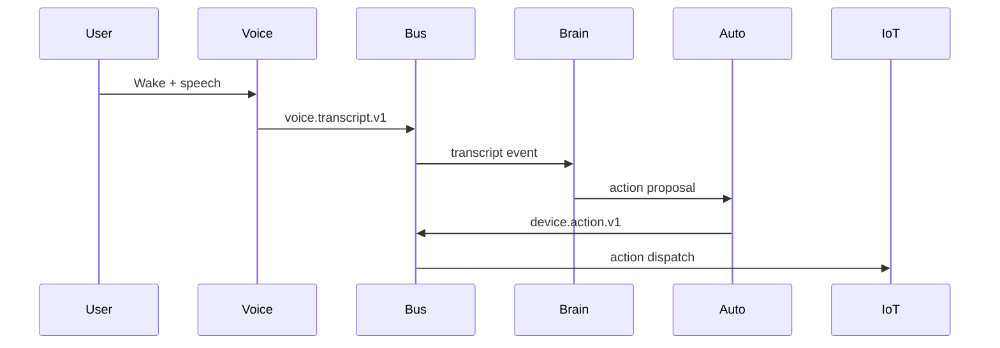

# J.A.R.V.I.S. Architecture Blueprint

## 1) Baseline Assessment & Gaps

**Current baseline (implemented):**
- Core orchestration (`JarvisCore`) with event bus, automation engine, memory, and safe command execution.
- Tests covering command safety, automation flow, and memory behavior.

**Key gaps vs. multimodal/automation requirements:**
- No real-time voice pipeline (wake word, streaming STT/TTS, interruption, speaker ID).
- No vision subsystem (tracking, presence, gesture, OCR, multi-camera).
- No IoT/device integration (MQTT/Home Assistant/industrial protocols).
- No AI orchestration layer (planner, tool registry, routing, RAG).
- No UI/HUD or dashboards.
- No observability, long-running reliability, or deployment stack.
- No production-grade security model (RBAC, audit logs, secrets).

## 2) Target System Architecture

**Service-oriented core with shared event bus and API gateway:**
- **API Gateway**: public REST + WebSocket interfaces, auth, rate limits, versioning.
- **Event Bus**: durable pub/sub (local Redis streams initially; upgrade to NATS/Kafka).
- **AI Brain Service**: planner/executor, tool routing, memory + RAG.
- **Voice Service**: wake word, streaming STT/TTS, speaker recognition, interruption.
- **Vision Service**: detection/tracking, OCR, presence, gesture.
- **Automation Service**: rules, schedules, context-based actions.
- **Device/IoT Service**: MQTT + adapters for HA/OPC UA/Modbus/Zigbee/KNX.
- **Security Service**: RBAC, audit logs, policy enforcement, secrets.
- **UI Services**: desktop HUD, web dashboard, mobile companion app.
- **Telemetry Service**: metrics, traces, health checks, self-diagnostics.

## 3) Repository Structure (Target)

```
/
  services/
    api-gateway/
    ai-brain/
    voice/
    vision/
    automation/
    device-integration/
    security/
    telemetry/
  apps/
    desktop-hud/
    web-dashboard/
    mobile-companion/
  libs/
    core-sdk/
    event-contracts/
    device-adapters/
  infra/
    docker/
    k8s/
    scripts/
  docs/
    architecture.md
    roadmap.md
  tests/
    unit/
    integration/
    contract/
```

## 4) Core Domain APIs & Schemas (v1)

**Versioning and compatibility rules**
- Contracts are **semver**. Breaking changes bump major.
- Event names include **version suffix** (e.g., `voice.transcript.v1`).
- Deprecations: minimum **2 minor releases** with dual publishing.

**Event Envelope**
```
{
  "id": "uuid",
  "name": "event.type.v1",
  "source": "service-name",
  "timestamp": "iso-8601",
  "trace_id": "uuid",
  "payload": { ... }
}
```

**Command Request**
```
{
  "id": "uuid",
  "command": "string",
  "context": { "user_id": "uuid", "session_id": "uuid" },
  "policy": { "allowlist_id": "default", "sandbox": true }
}
```

**Command Result**
```
{ "id": "uuid", "return_code": 0, "stdout": "...", "stderr": "..." }
```

**Device Action**
```
{
  "device_id": "string",
  "capability": "light.switch",
  "action": "turn_on",
  "params": { "brightness": 0.8 }
}
```

**Automation Rule**
```
{
  "id": "uuid",
  "name": "double-clap-lights",
  "trigger": { "event": "sound.double_clap.v1" },
  "conditions": [{ "type": "time", "after": "18:00" }],
  "actions": [{ "type": "device", "payload": { ... } }],
  "enabled": true
}
```

**Policy & Permissions**
```
{
  "role": "admin|operator|guest",
  "permissions": ["device.control", "command.execute"],
  "constraints": { "time_window": "09:00-22:00" }
}
```

**Memory Record**
```
{
  "id": "uuid",
  "type": "conversation|event|command|insight",
  "text": "string",
  "tags": ["user:alice", "context:home"],
  "created_at": "iso-8601"
}
```

**Telemetry**
```
{ "metric": "cpu.util", "value": 0.42, "timestamp": "iso-8601" }
```

**Audit Log**
```
{
  "actor": "user_id",
  "action": "device.control",
  "resource": "device:office_lamp",
  "result": "allowed|denied",
  "timestamp": "iso-8601"
}
```

## 5) AI Orchestration Layer

- **Tool registry** with signed tool descriptors and policy constraints.
- **Planner/Executor** for task decomposition and deterministic tool calling.
- **Context engine** with session state + preference profiles.
- **Memory + RAG**: embeddings, semantic search, and summarization.
- **Hybrid routing**: local LLMs for privacy/latency; cloud LLMs for complex reasoning.
- **Multi-agent** roles: perception, control, planning, and safety monitor.

## 6) Voice Service Roadmap

**Capabilities**
- Wake-word detection, streaming STT, low-latency TTS.
- Interruptible speech handling ("stop talking" cancels TTS).
- Speaker recognition + voiceprint auth.
- Multilingual pipeline with per-language profiles.

**Latency targets**
- Wake-to-response ≤ 300ms (local), ≤ 800ms (hybrid).

## 7) Vision Service Roadmap

- Face/person tracking, presence detection, gesture recognition.
- OCR and screen understanding.
- Multi-camera routing and per-camera privacy zones.
- Attention/focus estimation with configurable sensitivity.

## 8) Device & IoT Integration

- MQTT broker integration + Home Assistant bridge.
- Adapters: OPC UA, Modbus, Zigbee, KNX.
- Hardware bridges for ESP32/Arduino/PLC/SCADA.
- Capability registry to normalize device actions.

## 9) Automation Engine Expansion

- Rule-based and schedule-based triggers.
- Event-driven workflows with conditions and cooldowns.
- AI-suggested automations with approval workflow.
- Guardrails: allowlists, rate limits, and rollback safety.

## 10) Security & Permissions

- Local-first storage with encryption at rest.
- RBAC + device-level ACLs.
- Secure command execution with sandboxed runners.
- Secrets manager integration and audit logging.

## 11) UI/UX Strategy

- Desktop HUD with real-time telemetry and voice visualizer.
- Web dashboard for configuration and automation.
- Mobile companion for quick controls and alerts.

## 12) Observability & Reliability

- Structured logging with trace correlation.
- Metrics + distributed tracing.
- Health checks and self-diagnostics.
- Restart policies and circuit breakers for failure recovery.

## 13) DevOps & Deployment

- Dockerized services with compose for local stacks.
- Environment profiles: local, edge, cloud.
- CI/CD stages: lint → test → build → containerize → deploy.
- Optional Kubernetes overlays for scale-out.

## 14) Testing Strategy

- Unit tests per service + contract tests for APIs.
- Integration tests for event flows and device adapters.
- Security tests for policy enforcement.
- Performance baselines for latency and throughput.

## 15) Diagrams

**System Overview**


**Event Flow (Voice Command)**

